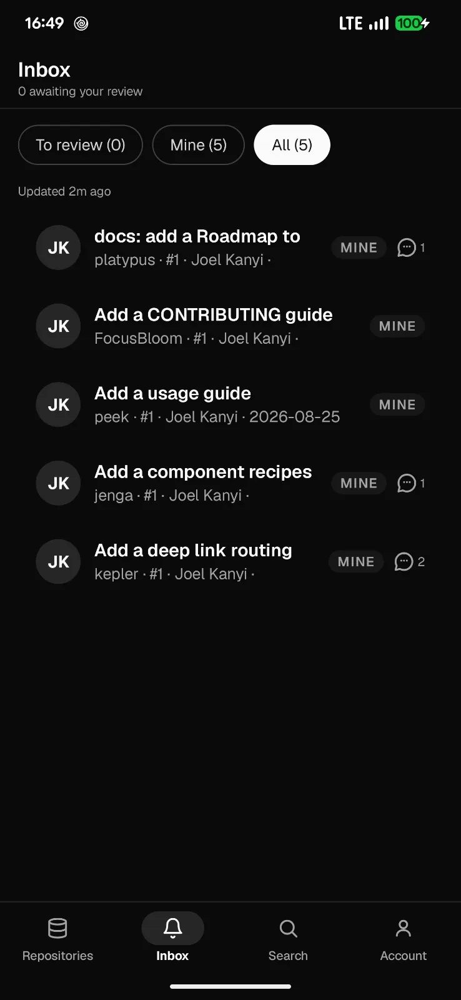
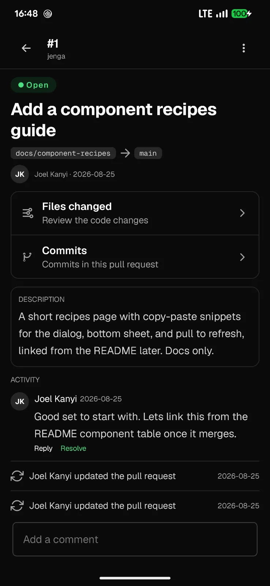
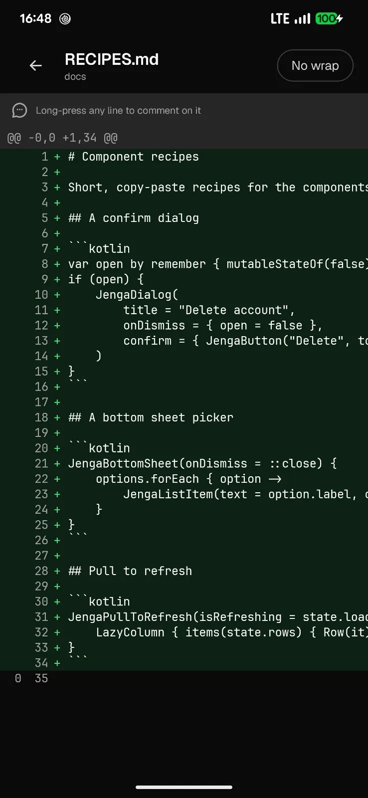
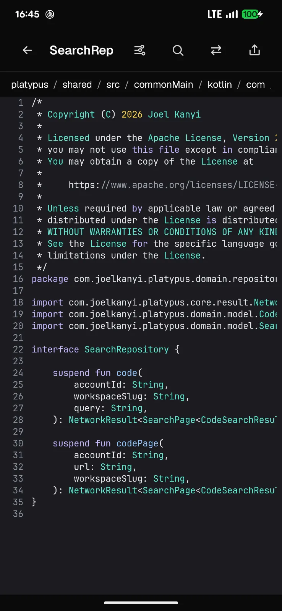
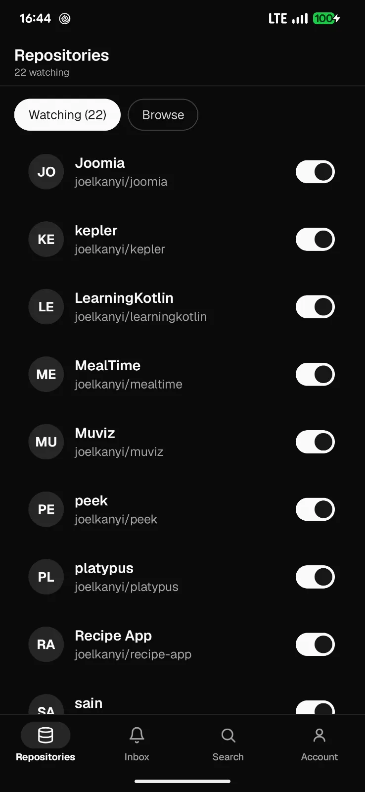
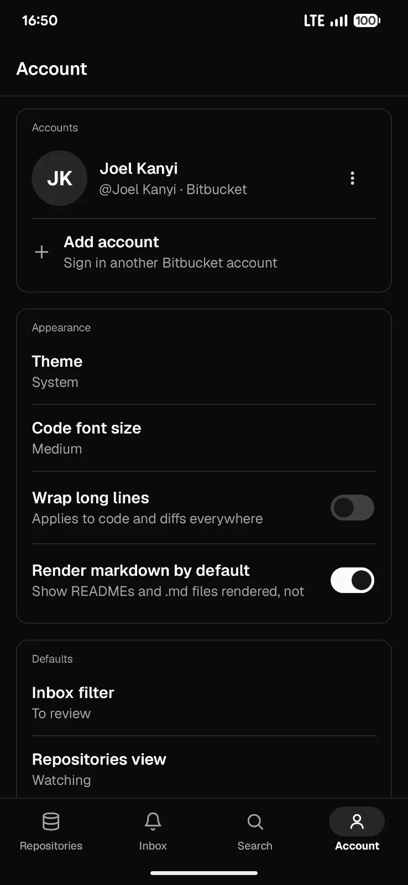

<div align="center">


# Platypus

**An unofficial Bitbucket Cloud client for Android and iOS, built with Kotlin Multiplatform.**

[](https://github.com/joelkanyi/platypus/releases)
[](https://kotlinlang.org/docs/multiplatform.html)
[](https://github.com/joelkanyi/platypus/releases)
[](LICENSE)

</div>

Platypus talks to Bitbucket Cloud directly from your device. Your repository content never
passes through a Platypus server, and there is no analytics or third-party tracking. One
Compose Multiplatform codebase runs on Android and iOS.

## Why

Reviewing pull requests and checking pipelines on Bitbucket's mobile web is painful. Platypus
is a native client built around the review path: the pull requests awaiting you across every
account and workspace, a real diff viewer, and one-tap approve or merge.

## Screenshots

<table>
  <tr>
    <td width="33%"><br/><sub><b>Reviewer inbox</b> across accounts</sub></td>
    <td width="33%"><br/><sub><b>Pull request</b> review</sub></td>
    <td width="33%"><br/><sub><b>Diff</b> with inline comments</sub></td>
  </tr>
  <tr>
    <td width="33%"><br/><sub><b>File viewer</b> with syntax highlighting</sub></td>
    <td width="33%"><br/><sub><b>Repositories</b> and watchlist</sub></td>
    <td width="33%"><br/><sub><b>Themes</b> and app lock</sub></td>
  </tr>
</table>

## Features

- Sign in with an Atlassian API token, or with Bitbucket (OAuth). Several accounts at once.
- A reviewer inbox aggregated across all your accounts and workspaces, filtered by
  To review, Mine, or All.
- Pull requests: files-changed diff, inline comments, approve, request changes, merge,
  decline, and comment threads with resolve.
- Repository explorer: browse files and folders, a syntax-highlighted viewer with wrap,
  find, and outline, plus branches, commits, diffs, a fuzzy file finder, and rendered
  Markdown.
- Pipelines: runs, steps, in-app logs, run, stop, re-run, deployments, and schedules.
- Code search across a workspace or within a single repository.
- Light and dark themes and a biometric app lock.

## Install

Android: download the signed APK from the [Releases](https://github.com/joelkanyi/platypus/releases)
page and sideload it. A Google Play listing is on the way.

iOS: build from source (below). No public distribution yet.

## Building

Requires JDK 21.

```
./gradlew :androidApp:assembleDebug
./gradlew :shared:compileKotlinIosSimulatorArm64
open iosApp/iosApp.xcodeproj
```

## Built with

Kotlin Multiplatform and Compose Multiplatform, one shared module for Android and iOS.
Ktor for networking, Room for local storage, Metro for compile-time dependency injection,
Coil for images, and Navigation 3. Android 7.0 (API 24) and up.

## Sign in with Bitbucket (OAuth)

Optional. API-token sign-in needs no setup. OAuth needs a small backend to hold the client
secret, because Bitbucket Cloud has no PKCE. Platypus uses a stateless Cloudflare Worker in
[`oauth-worker/`](oauth-worker/README.md); deploy your own and register a Bitbucket OAuth
consumer against it. The Worker only exchanges tokens; it never sees your repository content.

## Contributing

See [CONTRIBUTING.md](CONTRIBUTING.md).

## License

```
Copyright 2026 Joel Kanyi

Licensed under the Apache License, Version 2.0 (the "License");
you may not use this file except in compliance with the License.
You may obtain a copy of the License at

    https://www.apache.org/licenses/LICENSE-2.0

Unless required by applicable law or agreed to in writing, software
distributed under the License is distributed on an "AS IS" BASIS,
WITHOUT WARRANTIES OR CONDITIONS OF ANY KIND, either express or implied.
See the License for the specific language governing permissions and
limitations under the License.
```
